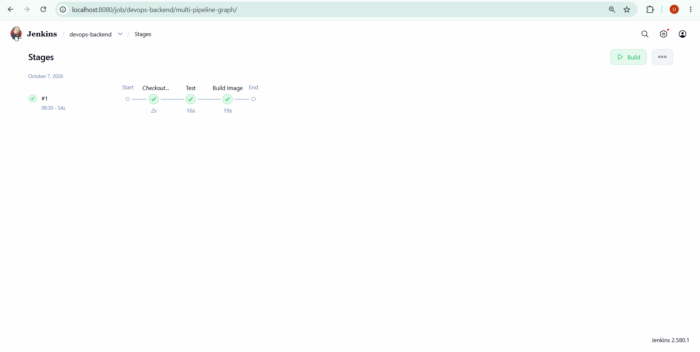
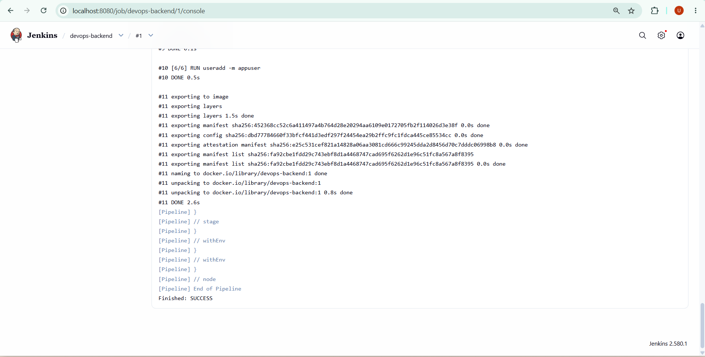
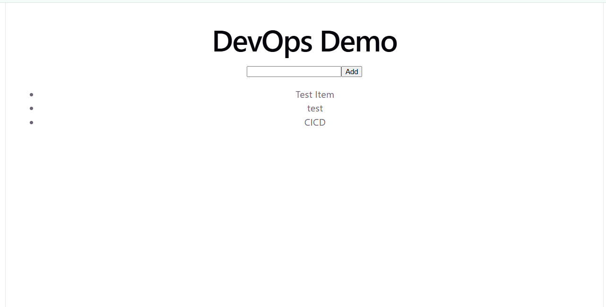

# 🚀 DevOps CI/CD Microservice

<p align="center">
  <strong>A containerized full-stack microservice with Flask, React, Redis, Docker Compose, Jenkins and GitHub Actions CI.</strong>
</p>

<p align="center">
  <a href="https://github.com/shaikumar11/devops-cicd-microservice">
    
  </a>
  <a href="https://github.com/shaikumar11/devops-cicd-microservice/actions">
    
  </a>
  
  
  
  
</p>

---

## 📌 Overview

**DevOps CI/CD Microservice** is a Dockerized full-stack application built to demonstrate practical DevOps and backend engineering skills.

It has three services: a **React** frontend served by **nginx**, a **Flask** REST API, and **Redis** for data storage. The whole stack starts with one Docker Compose command.

Every change is checked automatically by two CI systems:

- **GitHub Actions** runs on every push to `main`.
- **Jenkins** (running in Docker) runs the pipeline defined in the `Jenkinsfile`: it tests the backend with pytest, then builds the backend Docker image.

### 🎯 What this project demonstrates

- 🐳 Containerizing a multi-service application with Docker and Docker Compose
- 🏗️ Multi-stage Docker builds (Node build stage, nginx runtime stage)
- ⚡ REST API development with Flask
- 🗄️ Redis-backed storage
- 🔁 nginx reverse proxy with environment-based configuration
- 🧪 Automated testing with pytest (Redis mocked with fakeredis)
- 🔄 CI with GitHub Actions and Jenkins
- 📈 Health, readiness and Prometheus metrics endpoints
- ☁️ Deployment-ready configuration (same images run locally and on Render)

---

## ✨ Features

| Area | Description |
|---|---|
| 🖥️ Frontend | React (Vite) interface for adding and listing items |
| ⚡ REST API | Flask API served by gunicorn |
| 🗄️ Storage | Items are stored in Redis, so they survive page refreshes |
| 🐳 Docker | Frontend, backend and Redis run as separate containers |
| 🔄 GitHub Actions | Installs dependencies, runs tests and builds the Docker services on every push |
| 🧰 Jenkins | Local CI server running in Docker: test stage, then image build stage |
| 📈 Observability | `/health`, `/ready` and `/metrics` (Prometheus format) endpoints |

---

## 🏗️ Architecture

```text
                    ┌─────────────────────┐
                    │       Browser       │
                    └──────────┬──────────┘
                               │ HTTP :3000
                               ▼
                    ┌─────────────────────┐
                    │  Frontend (nginx)   │   serves the React build
                    │                     │   proxies /api/ to BACKEND_URL
                    └──────────┬──────────┘
                               │ /api/*
                               ▼
                    ┌─────────────────────┐
                    │   Backend (Flask)   │
                    │  gunicorn  :5000    │
                    └──────────┬──────────┘
                               │ REDIS_URL
                               ▼
                    ┌─────────────────────┐
                    │        Redis        │
                    └─────────────────────┘


                         CI FLOW

                         Git push
                            │
              ┌─────────────┴─────────────┐
              ▼                           ▼
      GitHub Actions                 Jenkins (Docker)
   install, test, build           pytest ─► build image
              │                           │
              └─────────────┬─────────────┘
                            ▼
                     Pass ✅ / Fail ❌
```

---

## 🛠️ Technology Stack

| Layer | Technology |
|---|---|
| Frontend | React + Vite |
| Web server / proxy | nginx |
| Backend | Python + Flask + gunicorn |
| Data store | Redis |
| Containerization | Docker |
| Orchestration | Docker Compose |
| Testing | pytest, fakeredis |
| CI | GitHub Actions, Jenkins |
| Version control | Git + GitHub |
| Hosting (demo) | Render |

---

## 📂 Project Structure

```text
devops-cicd-microservice/
│
├── .github/
│   └── workflows/
│       └── ci.yml
│
├── backend/
│   ├── Dockerfile
│   ├── app.py
│   ├── requirements.txt
│   ├── requirements-dev.txt
│   └── test_app.py
│
├── frontend/
│   ├── public/
│   ├── src/
│   │   ├── App.jsx
│   │   └── main.jsx
│   ├── Dockerfile
│   ├── nginx.conf
│   ├── package.json
│   └── vite.config.js
│
├── jenkins/
│   └── Dockerfile
│
├── docs/
│   └── (screenshots)
│
├── Jenkinsfile
├── docker-compose.yml
└── .gitignore
```

---

## 🚀 Getting Started

### Prerequisites

- [Docker Desktop](https://www.docker.com/products/docker-desktop/) (running)
- Git

Verify Docker:

```powershell
docker --version
docker compose version
```

### Run the full stack

```powershell
git clone https://github.com/shaikumar11/devops-cicd-microservice.git
cd devops-cicd-microservice
docker compose up --build
```

Open **http://localhost:3000**, add a few items, and refresh the page. The items are still there because they are stored in Redis.

Stop the stack with `Ctrl+C`, or run `docker compose down`.

### Test the API directly

```powershell
Invoke-RestMethod -Method Post -Uri http://localhost:3000/api/items -ContentType "application/json" -Body '{"name":"test"}'
Invoke-RestMethod http://localhost:3000/api/items
```

On macOS or Linux:

```bash
curl -X POST -H "Content-Type: application/json" -d '{"name":"test"}' http://localhost:3000/api/items
curl http://localhost:3000/api/items
```

---

## 🔌 API Endpoints

| Method | Path | Description |
|---|---|---|
| GET | `/health` | Liveness check, returns `{"status":"ok"}` |
| GET | `/ready` | Readiness check, returns 503 if Redis is unreachable |
| GET | `/api/items` | List all items |
| POST | `/api/items` | Add an item, body: `{"name": "..."}` (400 if `name` is missing) |
| GET | `/metrics` | Prometheus metrics (`app_requests_total`) |

---

## 🧪 Running the Backend Tests

```powershell
cd backend
py -m venv .venv
.venv\Scripts\Activate.ps1
pip install -r requirements-dev.txt
python -m pytest
```

On macOS or Linux, use `python3 -m venv .venv` and `source .venv/bin/activate`.

The tests use `fakeredis`, so no Redis server is needed.

---

## 🔄 CI/CD

### GitHub Actions

The workflow in `.github/workflows/ci.yml` runs on every push to `main`: it installs dependencies, runs the backend tests and builds the Docker services.

### Jenkins

Jenkins runs in a Docker container and executes the `Jenkinsfile`:

| Stage | What it does |
|---|---|
| Test | Creates a Python virtual environment, installs `requirements-dev.txt`, runs `pytest` |
| Build Image | Builds the backend Docker image tagged with the build number |

Start Jenkins locally:

```powershell
docker build -t my-jenkins jenkins
docker run -d --name jenkins -p 8080:8080 -p 50000:50000 -v jenkins_home:/var/jenkins_home -v /var/run/docker.sock:/var/run/docker.sock my-jenkins
docker exec jenkins cat /var/jenkins_home/secrets/initialAdminPassword
```

Then:

1. Open **http://localhost:8080** and unlock Jenkins with the password above.
2. Install the suggested plugins and create an admin user.
3. Create a **Pipeline** job with **Pipeline script from SCM**, Git, this repository URL, branch `*/main`.
4. Click **Build Now**.

#### Screenshots







---

## ⚙️ Configuration

| Variable | Used by | Purpose |
|---|---|---|
| `REDIS_URL` | backend | Redis connection string (default `redis://localhost:6379`) |
| `BACKEND_URL` | frontend (nginx) | Where `/api/` requests are proxied |

In `docker-compose.yml`:

```yaml
backend:
  environment:
    REDIS_URL: redis://redis:6379

frontend:
  environment:
    BACKEND_URL: http://backend:5000
```

The nginx config is installed as a template (`/etc/nginx/templates/default.conf.template`), so the official nginx image substitutes `${BACKEND_URL}` when the container starts. The same image can therefore point to a local backend or a hosted one without a rebuild.

---

## ☁️ Deployment (Render)

The backend can be deployed to [Render](https://render.com) from this repository:

1. Create a **Web Service** from the GitHub repo with `backend` as the root directory and Docker as the runtime.
2. Set `REDIS_URL` to a Redis instance reachable from Render.
3. For the frontend, set `BACKEND_URL` to the public backend URL (including `https://`).

Note: Render's free tier sleeps after inactivity, so the first request can take up to a minute.

---

## 🧭 Roadmap

- [ ] Push versioned images to a container registry from Jenkins
- [ ] Deploy to Kubernetes with a Helm chart
- [ ] Add Prometheus and Grafana monitoring using the existing `/metrics` endpoint
- [ ] Provision infrastructure with Terraform

---

## 👤 Author

**Shaikumar**
GitHub: [@shaikumar11](https://github.com/shaikumar11)
